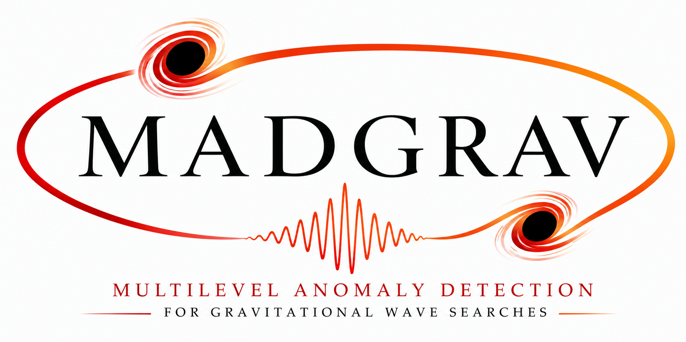

<p align="center">
  
</p>

# MADGRAV

**M**ultilevel **A**nomaly **D**etection for **GRAV**itational-wave science — a portable, cluster-deployable
(SLURM) blind gravitational-wave search.

Developed by **G. Inguglia et al.**

## Overview

MADGRAV is a multilevel anomaly-detection search: a frozen convolutional autoencoder (CAE) front end →
LR / glitch-arm cascade → CNN (high-mass + low-mass specialists) + coherence → time-slide-calibrated FAR.
The CAE is trained in two stages — an **unsupervised** reconstruction pass that learns the detector-noise
manifold, then a **weak-supervision** margin fine-tune on simulated signals — so the deployed front end is a
*weakly-supervised* noise-manifold anomaly detector (not a pure unsupervised reconstruction score).
This package is configured for the **O3a 56-segment validation** run (the accepted config:
candidate floor 4.5 / net-σ floor 4.0 / per-arm CNN ranking / blind floor / coherence ceiling 0.85).
It **scales to the full O3a (485-segment) analysis** by swapping the segment list (`SM_BGJSON` /
`SM_SEGJSON_EV` / `SM_VETO`) and growing the shard count / SLURM array size — no code changes.

All science constants, thresholds, the device-resolution logic, and the ranking statistic are unchanged
from the dev pipeline; only paths were made portable via a single `MADGRAV_ROOT` root.

## Layout

```
madgrav/
  README.md  environment.yml  .gitignore  check_install.py
  search_mode/          # core drivers + small vendored .pt/.json assets
  spectrogram_cascade/  # massive_pipeline.py + massive_calibration_BA.json
  improved/             # improved_pipeline.py, prepare_o1_data.py, utilities.py (vendored)
  lr_cascade/p1v42/     # arm_deploy_seed0..4.pt (5-seed glitch arm)
  assets/models/        # baseline_cae_weaksup_best.pt (frozen CAE)
  data/o3a_search_prep/ # reference_psd_H1.npz, reference_psd_L1.npz (run-matched ASD)
  launchers/            # run_search.sh, slurm_search.sbatch, run_merge.sh
```

## Install

```bash
conda env create -f environment.yml
conda activate madgrav
export MADGRAV_ROOT=$(pwd)        # the package root
```

Pin `torch` + CUDA in `environment.yml` to the build the frozen weights were trained/calibrated with.
Do **not** add `ml4gw` (its whitening changes the coherence statistic and the results).

## Data provisioning

The cluster has **no strain data shipped with this package** (~262 GB). Build it once, in order, from
within `$MADGRAV_ROOT` (set `MADGRAV_ROOT` first):

1. The 56-seg segment / veto JSONs are **already vendored** (`o3a_bg_segments_56.json`,
   `veto_mask_o3a_56.json`), so this step is normally skipped. `search_mode/prep_o3a_56.py` is the
   provenance recipe that regenerated them from the batch-1/batch-2 inputs (those inputs are not
   shipped; the script exits cleanly if they are absent).
2. `python search_mode/fetch_locks.py` then `python search_mode/fetch_bg.py` — pull ~262 GB of O3a strain
   from GWOSC into `search_mode/strain_o3a/`. (`fetch_bg_par.py` / `fetch_bg_resilient.py` are
   parallel / resume-safe variants.)
3. `python search_mode/inject.py --event NAME` — build injection priors (efficiency / recovery).
4. `python search_mode/driver_streams.py` — build the per-detector streams.
5. `python search_mode/build_series_cache_o3a.py` — build the ~130 GB whitened coherence-series cache
   (reclaimable page-cache; reused across all shards).

## Run

Single node (bash, no systemd):
```bash
export MADGRAV_ROOT=$(pwd)
bash launchers/run_search.sh          # runs SM_NSHARD sequential shards, then the merge
```

SLURM (one shard per array task):
```bash
export MADGRAV_ROOT=$(pwd)
jid=$(sbatch --parsable launchers/slurm_search.sbatch)
sbatch --dependency=afterok:${jid} --wrap="bash launchers/run_merge.sh"
```
Edit the `#SBATCH` placeholders (`--partition`, `--account`, `--time`, `--mem`, `--cpus-per-task`) and keep
`--array=0-15` in sync with `SM_NSHARD`. Results land in `search_mode/search_out_o3a_56_perarm/`
(`blindscan.json`, `detections.json`, `survivors_bg.json`).

Knobs (env): `MADGRAV_PY` (python), `BLIND_DEV` (GPU, default `cuda:1`; the device logic degrades gracefully
and allows CPU only with `SM_ALLOW_CPU=1`), `SM_NSHARD`, `SM_HOST_MEM_GB`.

## Verify

```bash
cd $MADGRAV_ROOT
MADGRAV_ROOT=$(pwd) SM_ALLOW_CPU=1 python check_install.py
```
Checks every vendored asset is present and the core module closure imports. It does **not** run the
pipeline, fetch data, or require strain.

## Quick demo

Recover **GW190521** (the intermediate-mass black-hole binary) end-to-end from a small bundled
256 s strain segment using the vendored weights — **no GWOSC fetch, ~2 min on a GPU**:

```bash
git clone <repo> && cd madgrav
conda env create -f environment.yml && conda activate madgrav
export MADGRAV_ROOT=$(pwd)
bash demo/run_demo.sh
```

This whitens the bundled segment with a **local ±64 s Welch ASD**, runs the CAE σ stream, and scores the
loudest net-σ trigger with the HM/LM CNN glitch-gate. Expected result: the GW190521 merger window fires
**net σ ≈ 7.7** and the CNN keeps it (**HM ≈ 0.99, LM ≈ 0.95 > 0.5**) → `RECOVERED`. The bundled segment
lives in `demo/strain/` (~8 MB, keys: `strain`, `gps_start`, `fs`); its provenance / regeneration recipe
is `demo/make_demo_segment.py`.

`DEV` selects the device — any free GPU (default `cuda:0`) or, as a last resort, CPU:
```bash
DEV=cuda:2 bash demo/run_demo.sh                # another GPU
DEV=cpu SM_ALLOW_CPU=1 bash demo/run_demo.sh    # CPU: slower, NOT byte-identical to the frozen GPU calibration
```

**Cross-run caveat** (see the `demo/recover_event.py` docstring): the whitening uses a **whole-segment
Welch ASD** computed from this 256 s segment (the signal is in-band in the PSD, which mildly
self-suppresses it — conservative for a recovery test), but the **learned weights (CAE, 5-seed glitch
arm, HM/LM CNNs) remain O4a-trained**. Only those weights are cross-run; the result is a single-segment
RECOVERY test (net-σ trigger kept by the CNN gate), **not** a FAR measurement — one short segment has no
time-slide livetime.

## Notes

- The frozen weights (CAE, glitch arm, HM/LM CNNs) are **calibration-locked**. The **GPU forward pass is the
  calibrated path**; CPU forward is **not** byte-identical, so a production / FAR run must run on GPU
  (`SM_ALLOW_CPU=1` is for install checks only).
- Do **not** add `ml4gw` — it changes the coherence statistic and the results.
- Whitening uses the run-matched reference ASD in `data/o3a_search_prep/`.
- The vendored weights (CAE `assets/models/baseline_cae_weaksup_best.pt`, 5-seed glitch arm
  `lr_cascade/p1v42/`, HM/LM CNNs `search_mode/{hm,lm}_native_seed0.pt`) and the BA calibration
  (`spectrogram_cascade/massive_calibration_BA.json`) are **frozen, distributed artifacts** — this
  package runs and reproduces results *with* them but does not retrain them; their training/calibration
  code and data are not part of this release.

## Citation

MADGRAV implements and extends the anomaly-detection search introduced in:

> G. Inguglia, H. Haigh, K. Vitulová, U. Dupletsa,
> *Towards an anomaly detection pipeline for gravitational waves at the Einstein telescope*,
> **Physics Letters B 874 (2026) 140272**.
> doi:[10.1016/j.physletb.2026.140272](https://doi.org/10.1016/j.physletb.2026.140272) ·
> preprint: [arXiv:2511.13154](https://arxiv.org/abs/2511.13154)

If you use this software, please cite the paper (a `CITATION.cff` is included, so GitHub's
**“Cite this repository”** button exports the entry below):

```bibtex
@article{Inguglia2026MADGRAV,
  title   = {Towards an anomaly detection pipeline for gravitational waves at the Einstein telescope},
  author  = {Inguglia, Gianluca and Haigh, Huw and Vitulov\'a, Krist\'yna and Dupletsa, Ulyana},
  journal = {Physics Letters B},
  volume  = {874},
  pages   = {140272},
  year    = {2026},
  doi     = {10.1016/j.physletb.2026.140272}
}
```

## Acknowledgements

Orchestration of the execution tasks and the agent-pool code review were carried out with
[Claude Code](https://claude.com/claude-code) (Anthropic).
